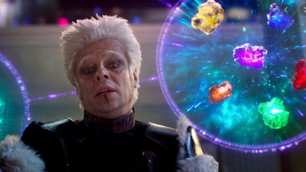
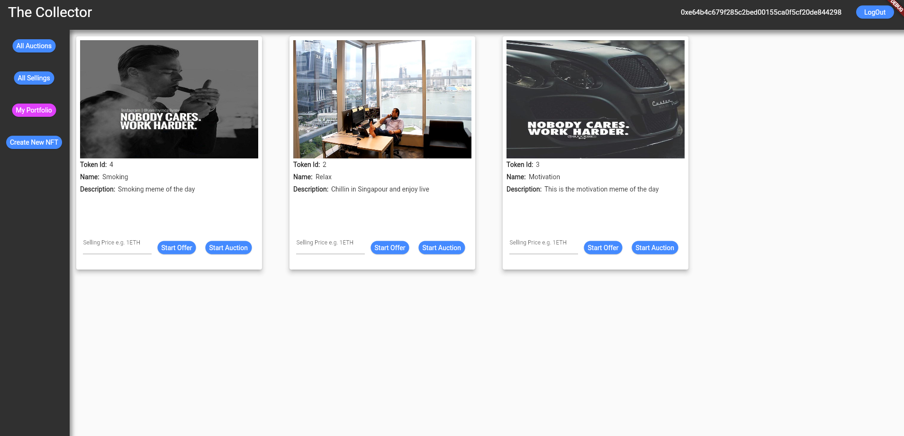
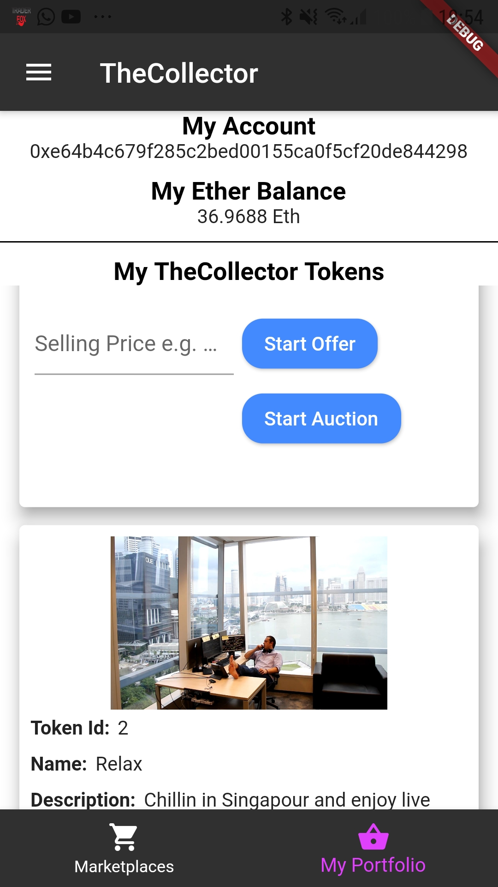

# The Collector

The collector will be a complete universe for creating, selling, swapping and making Auctions with your NFT.

It will have a WEB Frontend like this first example

and also a Mobile Frontend both like this

written with Flutter.

The Backend is mainly directly on the Blockchain and IPFS as well as some parts are managed with Moralis.