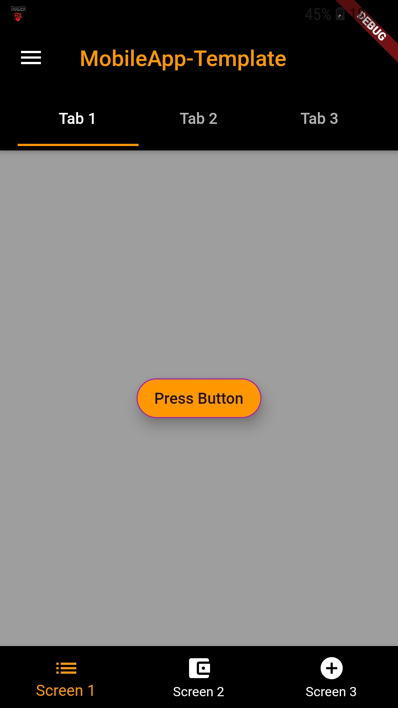
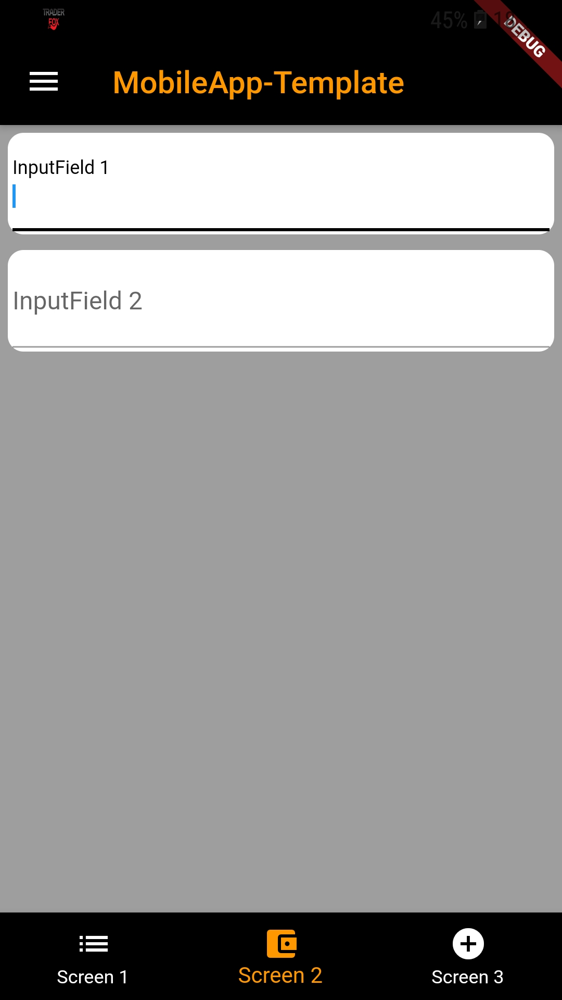
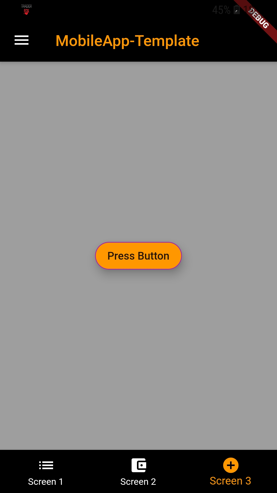
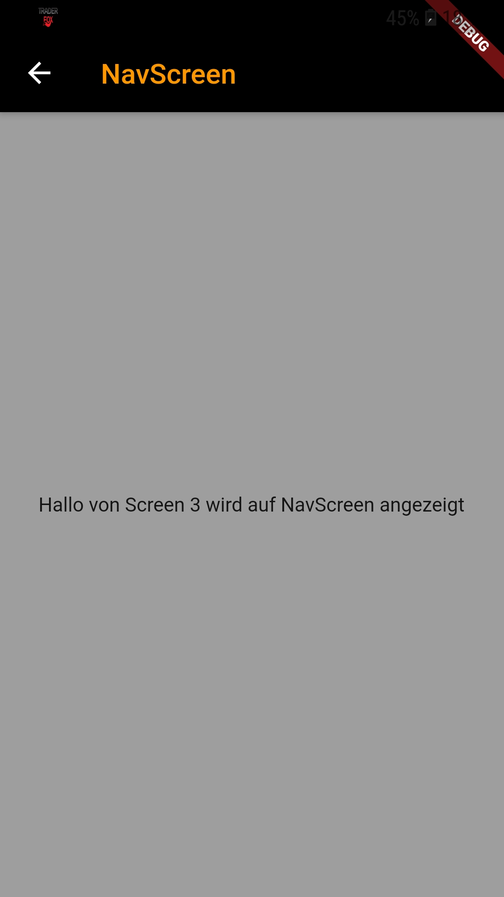
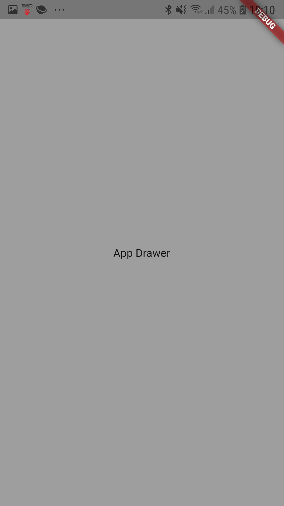

# moible_app_template

This is a simple template for a mobile application with Flutter. It contains 

- TabBar

- Bottomnavigation Bar

- AppDrawer

- page Navigation

- Widgets for Raised Buttons

- Widgets for TextinputFields

- Widgets for Showup dialog window

